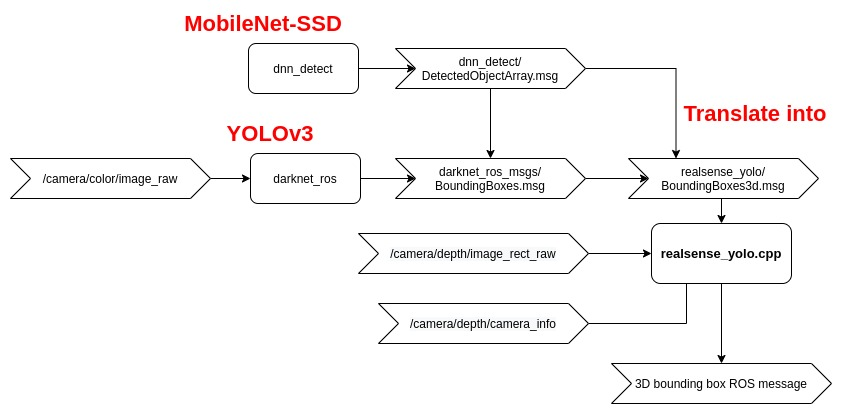
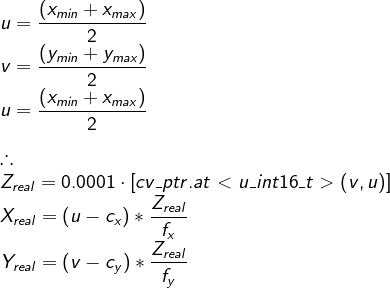
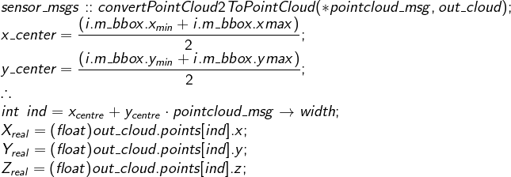

### Overview
The motivation of this repository is to get the 3D object detection from 2D detection model such as YOLOv3 and MobileNet-SSD using depth information from RGBD camera such as realsense-D435.

-------------
### Architecture
The first object detecion model that I used is YOLOv3. I extract the 3D real world coordinate using the methods that have been described in the following section. Then I decided to use MobileNet-SSD model. Laziness to the max, I decided to translate the detection output from MobileNet-SSD into YOLOv3 detection msg act as the interface. The code structure will be (maybe...) rephrased in future.



-------------

### Dependencies
* [darknet_ros](https://github.com/leggedrobotics/darknet_ros)
* [dnn_detect](https://github.com/UbiquityRobotics/dnn_detect)
* OpenCV 3
-------------
### Usage

-------------
### Pixel convert to Real distance:
 1. From Intrinsic Camera Calibration <br/>
	 **Idea:** From YOLO detection result get xmin,xmaxmymin & ymax [Link](https://vision.in.tum.de/data/datasets/rgbd-dataset/file_formats#intrinsic_camera_calibration_of_the_kinect)

	
	
 2. PointCloud from PointCloud2 to get xyz <br/>
	 **Idea:** Convert PointCloud2 to PointCloud and get the distance from the respective pixel [Link](https://answers.ros.org/question/9239/reading-pointcloud2-in-c/) <br/>

	
-------------
### Troubleshooting
1. Theora & Compressed Depth Image Transport **Error** while rosbag record
	* cv_bridge exception: '[16UC1] is not a color format. but [bgr8] is.
	* Compressed Depth Image Transport - Compression requires single-channel 32bit-floating point or 16bit raw depth images (input format is: rgb8). 
	Solution: [Link](https://github.com/IntelRealSense/realsense-ros/issues/315#issuecomment-531382378)

	```
	rosbag record -a -O realsense_bag.bag -x "(.*)/compressed(.*)|.*(theora)"
	```
2 . Verify the calculated distance (if you are using the realsense SDK) <br/>
- Use **realsense-viewer** GUI to get the x,y & z real world distance and compare the value with the result from computation.

-------------
#### TODO (someday, maybe)
	- [ ] Tracking such as using deep_sort
	- [ ] Remove dependacy on specer_project 	
	- [ ] Person mesh on visualization
	- [ ] More object detection network 
	- [ ] Upload rosbag file for testing
	- [ ] Incorporate zed-camera
	- [ ] Restructure the file