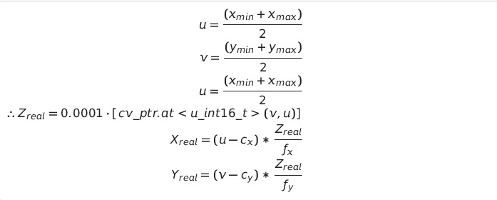

### Overview
The motivation of this repository is to get the 3D object detection from 2D detection model such as YOLOv3 and MobileNet-SSD using depth information from RGBD camera such as realsense-D435.

-------------
### Architecture
You can use any detectors with any ROS messages you like with this code. You just need to write an adaptor to convert the ROS messages into [realsense_yolo::BoundingBoxes3d.msg](msg/BoundingBoxes3d.msg), Here is an [example](src/yolov4_tensorRT_adaptor.cpp) for yolov4 tensorRT from  [ros_deep_learning](https://github.com/dusty-nv/ros_deep_learning)

<p align="center">
	
	code_architeture
</p>

-------------

### Dependencies
* OpenCV 3
* And the ROS message from your detector for the adaptor 
-------------

### Adaptor provided
- MobileNet-SSD tensorRT from [ros_deep_learning](https://github.com/dusty-nv/ros_deep_learning)
- yolov4 tensorRT from [yolov4_trt_ros](https://github.com/indra4837/yolov4_trt_ros)
- MobileNet-SSD from [dnn_detect](https://github.com/UbiquityRobotics/dnn_detect)
-------------
### Usage
- set either mobilenetssd, mobilenetssd_tensorRT or yolov4_tensorRT in launch file to **true** ,then run the following command:</br>
	```console
	roslaunch realsense_yolo realsense_yolo.launch
	```
-------------
### How to convert Pixel distance to Real world distance:
 1. From Intrinsic Camera Calibration <br/>
	 **Idea:** From YOLO detection result get xmin,xmax,ymin & ymax </br>[Intrinsic_camera_calibration_of_the_kinect](https://vision.in.tum.de/data/datasets/rgbd-dataset/file_formats#intrinsic_camera_calibration_of_the_kinect)

	<p align="center">
		
		From_Intrinsic_Camera_Calibration
	</p>
	
 2. PointCloud from PointCloud2 to get xyz <br/>
	 **Idea:** Convert PointCloud2 to PointCloud and get the distance from the respective pixel <br/>
	 [Link](https://answers.ros.org/question/9239/reading-pointcloud2-in-c/) <br/>

	<p align="center">
		
		PointCloud_from_PointCloud2_to_get_xyz
	</p>
-------------
### Troubleshooting
1. Theora & Compressed Depth Image Transport **Error** while rosbag record
	* cv_bridge exception: '[16UC1] is not a color format. but [bgr8] is.
	* Compressed Depth Image Transport - Compression requires single-channel 32bit-floating point or 16bit raw depth images (input format is: rgb8). 
	Solution: [Link](https://github.com/IntelRealSense/realsense-ros/issues/315#issuecomment-531382378)

	```
	rosbag record -a -O realsense_bag.bag -x "(.*)/compressed(.*)|.*(theora)"
	```
2 . Verify the calculated distance (if you are using the realsense SDK) <br/>
- Use **realsense-viewer** GUI to get the x,y & z real world distance and compare the value with the result from computation.

-------------
#### TODO (someday, maybe)
	- [ ] Tracking such as using deep_sort
	- [ ] Remove dependacy on specer_project 	
	- [ ] Person mesh on visualization
	- [ ] More object detection network 
	- [ ] Upload rosbag file for testing
	- [ ] Incorporate zed-camera
	- [ ] Restructure the file